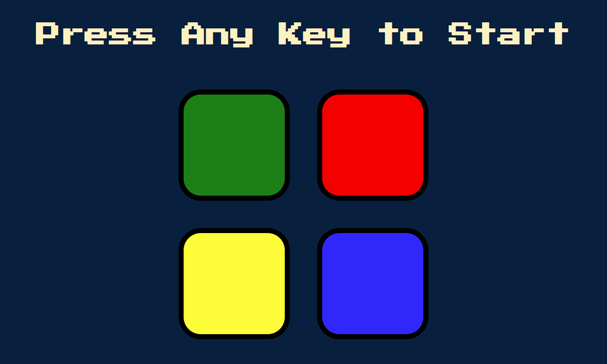

# Simon Game

The 1978 Simon (game) cloned using HTML, CSS, and JavaScript.  
This game can be played both on PC and mobile devices.

## Table of Contents

* [Gameplay](#gameplay)
* [Thanks](#thanks)

## Gameplay

1. The game has four colored buttons, each producing a particular tone when it is clicked.  

  

2. A round in the game consists of lighting up one or more buttons in a random order, after which the player must reproduce that order by pressing the buttons.  

3. As the game progresses, the number of button to be pressed increases.  

4. If the player fails to reproduce the correct button order, the game will end.

## Project Tree

    ├─ images
    │  ├─ game_over_screen.png
    │  ├─ level_screen.png
    │  └─ start_screen.png
    ├─ sounds
    │  ├─ blue.mp3
    │  ├─ green.mp3
    │  ├─ red.mp3
    │  ├─ wrong.mp3
    │  └─ yellow.mp3
    ├─ favicon.ico
    ├─ game.js
    ├─ index.html
    ├─ README.md
    └─ styles.css

## Thanks

Special thanks to:
* Angela Yu from The App Brewery
